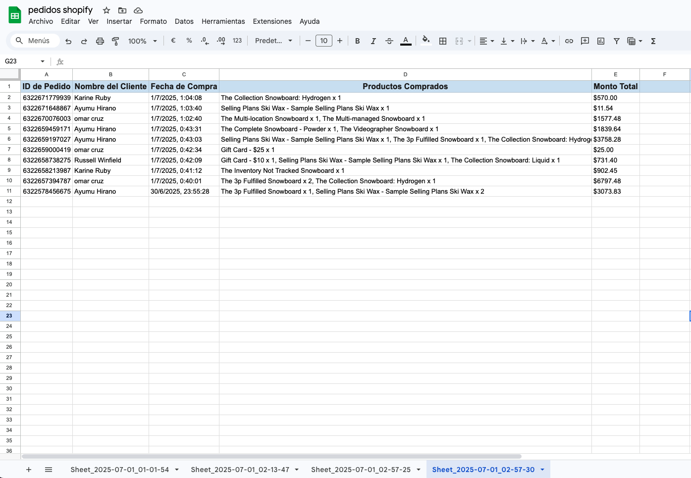

# 🛍️ Shopify Order Reporter 📊

Este proyecto genera automáticamente reportes de pedidos recientes desde una tienda **Shopify**, los formatea y los guarda en **Google Sheets**.  
Ideal para monitorear ventas, generar reportes automáticos y compartir con tu equipo.

---

## 🚀 Funcionalidades

- ✅ Obtiene pedidos desde la API REST de Shopify
- ✅ Crea una nueva hoja en Google Sheets con nombre dinámico
- ✅ Inserta pedidos con formato: ID, cliente, fecha, productos, total
- ✅ Aplica estilo visual: encabezados, bordes, autoajuste de columnas
- ✅ Soporta ejecución manual o automática (cron)
- ✅ Se agrego como extra a los requerimientos ejecución vía cron

---

## 📁 Estructura del proyecto

shopify-products/
├── src/
│ ├── config/ # Variables de entorno
│ ├── services/ # Shopify + Google Sheets
│ ├── utils/ # Funciones auxiliares
│ ├── core/ # Lógica principal
│ └── index.ts # Ejecución manual
├── .env.example # Plantilla de configuración
├── credentials.json # Clave de Google Sheets (IGNORADA por git)
├── package.json
└── README.md

---

## ⚙️ Requisitos

- Node.js v18 o superior
- Cuenta de Shopify con acceso API (https://farmacia-productos.myshopify.com/)
- Proyecto en Google Cloud con Google Sheets API habilitada (https://docs.google.com/spreadsheets/d/1B2KfZQaqOCiRZpg8PNpGkXOGkrlp_0a9yACAo91vvIE/edit?pli=1&gid=449306124#gid=449306124)
- Hoja de cálculo Google Sheets creada y compartida con la cuenta del servicio

---

## 🔧 Instalación y configuración

1. Clona el repositorio:

Las variables de entorno y el archivo credentials se estaran compartiendo por aparte, debio a que github bloquea el arcivo y google elimina elimina las credenciales.

```bash
git clone https://github.com/omarrendon/google-sheet-report
cd shopify-products
npm install
cp .env.example .env
touch credentials.json
```

## 🧪 Comandos para ejecutar el proyecto

1. Generar reporte vía manua

```
npm start
```

2. Generar reporte vía cron job

```
npm run cron
```

## Imagenes del proyecto

### Tabla de Google Sheet completa



### Hojas creadas dinamicamente


## 🧩 ¿Cómo implementarías esta solución en producción?

Implementaría esta solución en producción utilizando un cronjob programado en un entorno de servidor confiable (como Vercel Cron o un servidor con PM2) que ejecute el script automáticamente a intervalos definidos, por ejemplo, yo lo implementaría una vez al día por las mañanas para así tener toda la informacion de las vents más recientes del día anterior.

La lógica ya está preparada para generar un nuevo reporte en Google Sheets en cada ejecución, lo que permite automatizar el proceso completamente sin intervención manual. Además, si en dado caso se requiere información más reciente durante el trayecto del día se puede implementar la ejecución manual, también puede ejecutarse fácilmente con un script local (npm start).

Alternativamente, podría integrarse un webhook desde Shopify para ejecutar el script automáticamente al momento de que ocurra un nuevo pedido, aunque esto requeriría una pequeña API que reciba los eventos y dispare la lógica del reporte.

En resumen, el proyecto puede escalar desde una ejecución manual hasta una integración completamente automatizada, dependiendo de los requerimientos operativos.
